# Engenharia de Prompt

 Projeto realizado para o curso de Desenvolvimento de Sistemas.

 ## Grande Modelo de Linguagem (LLM):
 LLM (Large Language Models) é um modelo de linguagem de grande porte é um tipo de algoritmo de inteligência artificial que aplica técnicas de redes neurais com diversos parâmetros para processar e compreender linguagens humanas ou textos usando técnicas de aprendizado autossupervisionado. Tarefas como geração de texto, tradução automática, redação de resumos, geração de imagens a partir de textos, codificação automática, chatbots ou IA conversacional são aplicações do Modelo de Linguagem de Grande Porte.
## O que é GPT?
O GPT é uma inteligência artificial generativa, possui uma arquitetura baseada em redes neurais e possibilita gerar conteúdo a partir de um comando.
## O que é Engenharia de Prompt?
É o processo de gerar prompts, ou comandos, para um modelo de Inteligência Artificial baseado em uma linguagem como o ChatGPT, da OpenAI. Essa disciplina foca na formulação de comandos adequados para otimizar as respostas e a interação com o modelo de IA. Em outras palavras, visa gerar resultados relevantes e úteis para uma questão.
## Porque Engenharia de Prompt é crucial para Desenvolvedores de Sistemas?
O campo de prompt engineering é muito importante para usufruir do potencial da IA generativa em diversos segmentos de um negócio. Com o avanço nos modelos de IA pautados em linguagem, essa área tem se tornado popular, principalmente por apoiar a criação de interações mais significativas e precisas com os modelos. 
## Quais são os Princípios Fundamentais da Construção de Prompts?
Para que um modelo generativo como o ChatGPT possa responder adequadamente aos prompts, é preciso considerar alguns fatores para aumentar o nível de confiabilidade de respostas do sistema.
- Começar simplificando os comandos; 
- Fornecer instruções claras para o modelos; 
- Garantir o máximo de especificidade aos  prompts, oferecendo detalhes e exemplos;
- Evitar imprecisões e comandos generalistas. Ao invés de dizer “cite algumas músicas de Bruno Mars”, diga “cite as cinco músicas mais famosas do cantor Bruno Mars”.
- Optar por comandos que digam ao modelo o que fazer, ao invés de dizer o que não fazer, etc.
## Cite as principais Ferramentas de IA Generativa Relevantes para Desenvolvimento de Sistemas.
- ChatGPT
- Gemini 
- Copilot
- Codium AI
- Cursor Ai
- Claude AI  

## Técnica de Engenharia de Prompt
### ZERO-SHOT
É prompt mais simples, onde simplesmente faz-se uma pergunta ou dá-se ima introdução simplista ao modelo:

#### Prompt 1
Gemini

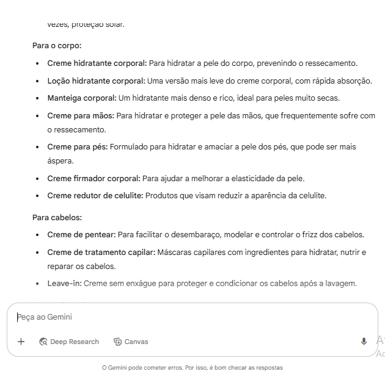
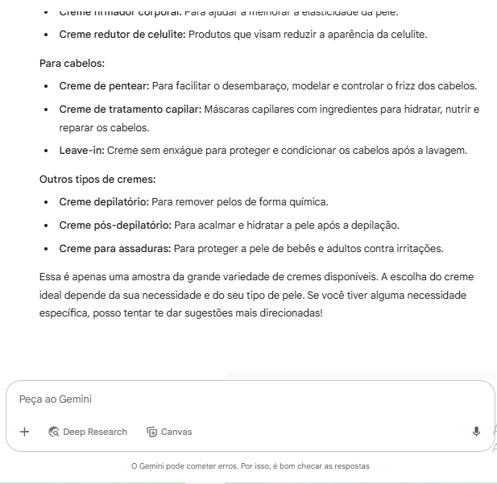

#### Prompt 2
Gemini

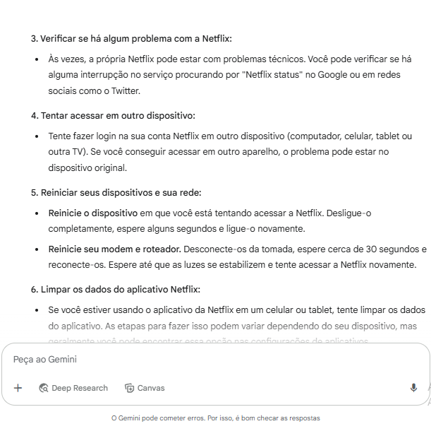
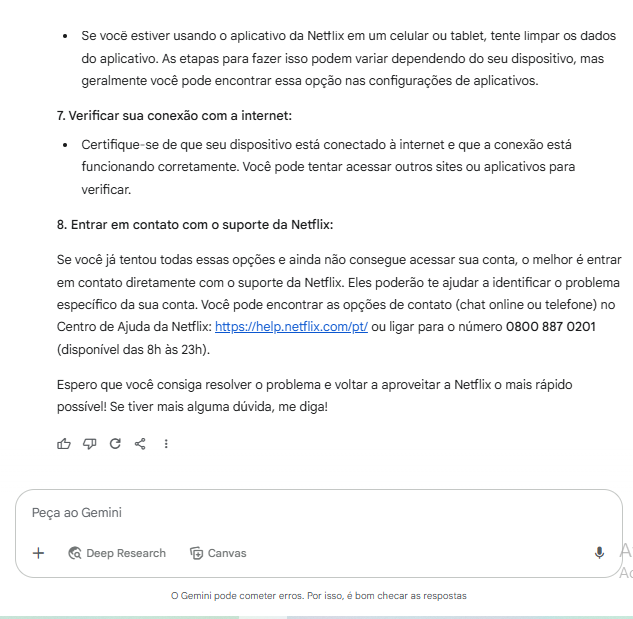

####  Prompt 3
ChatGPT
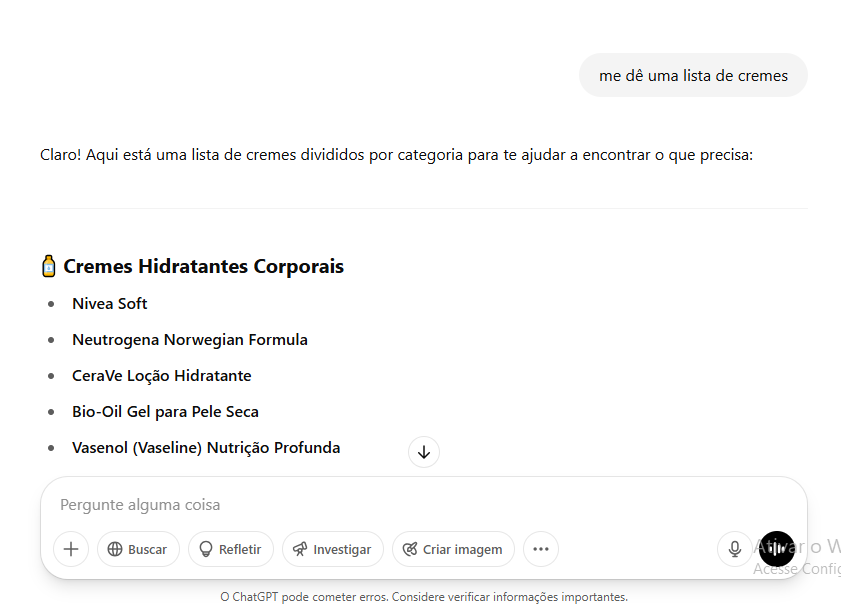

####  Prompt 4
ChatGPT
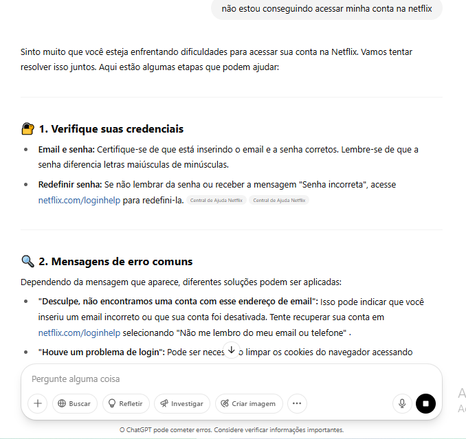
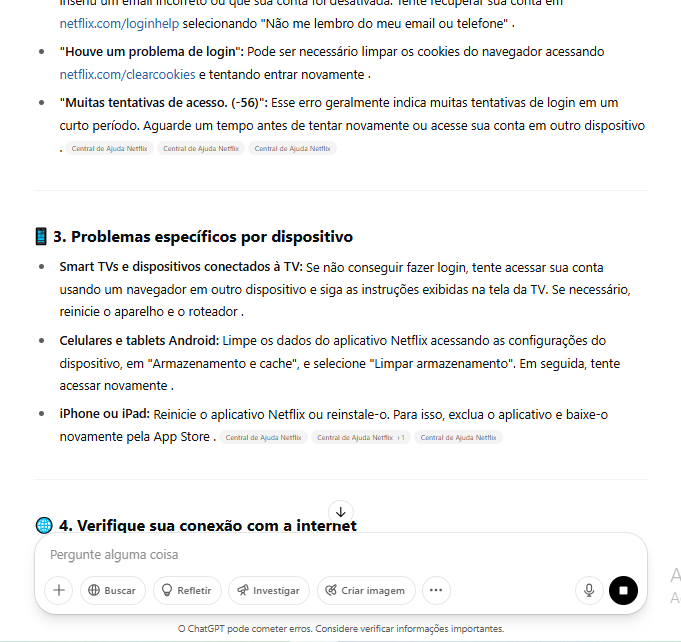
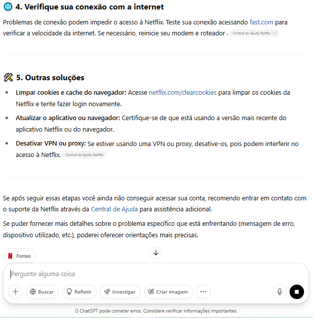

### FEW-SHOT
Técnica em engenharia de prompt que utiliza alguns exemplos (dois ou mais) dentro do prompt para ajudar modelos de IA a aprender e realizar tarefas complexas.

#### Prompt 1
Gemini
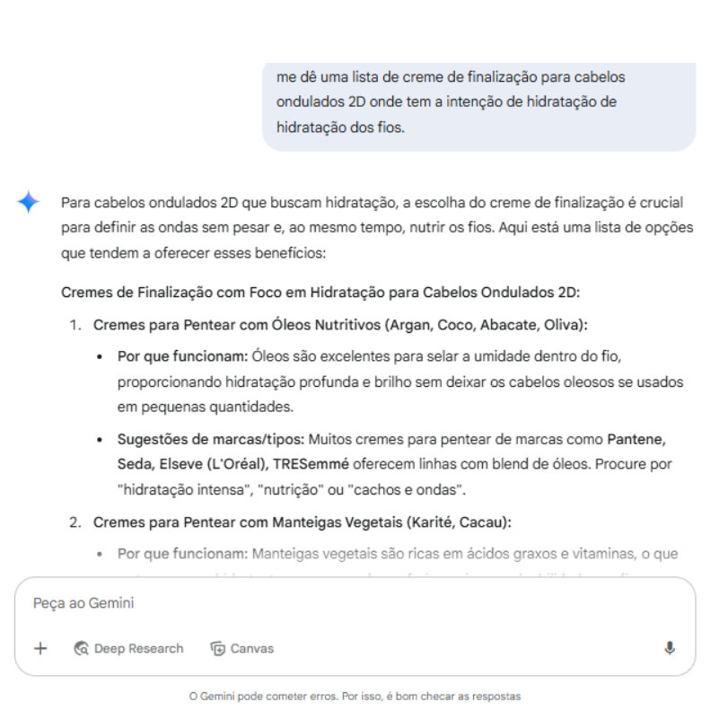
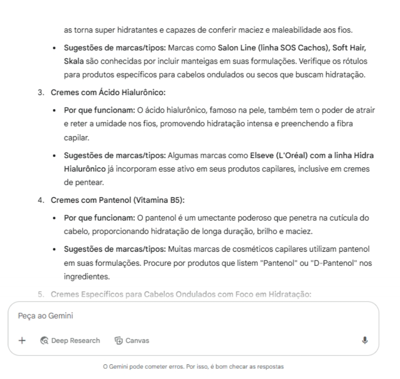
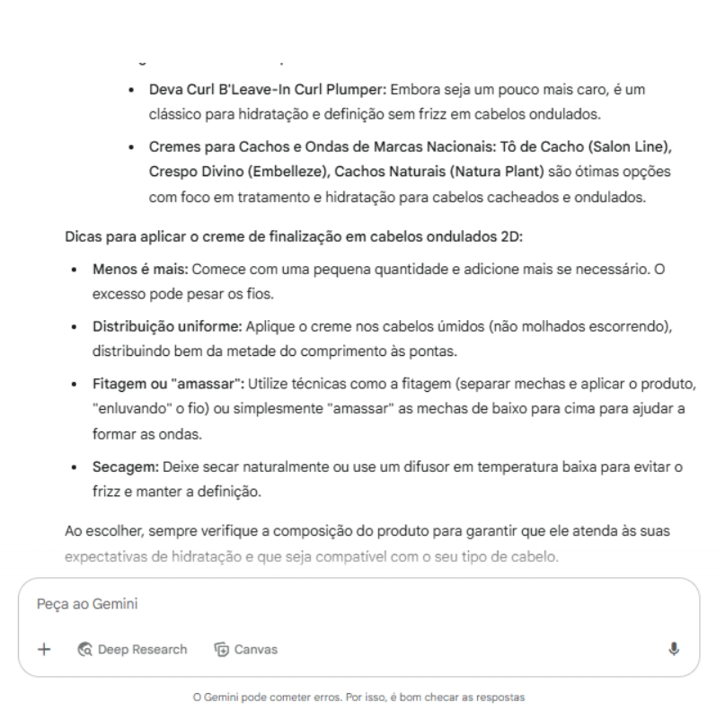

#### Prompt 2
Gemini
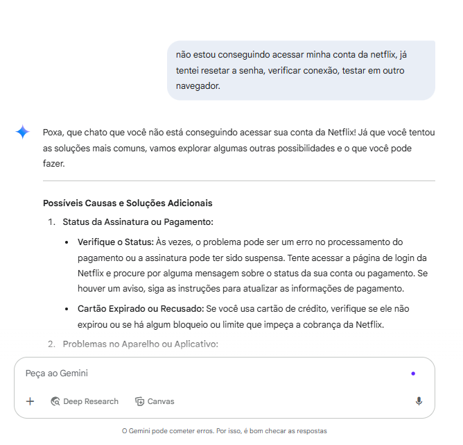
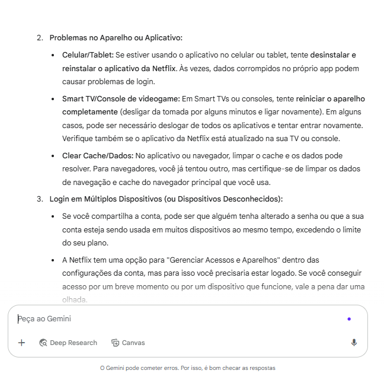
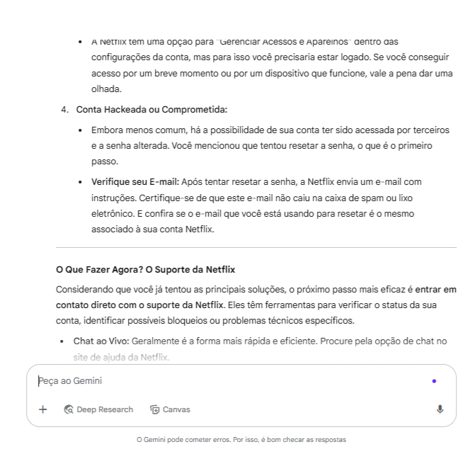
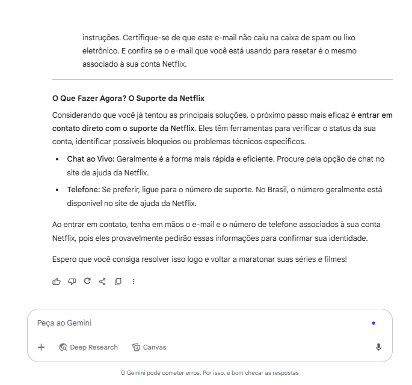

#### Prompt 3 
ChatGPT

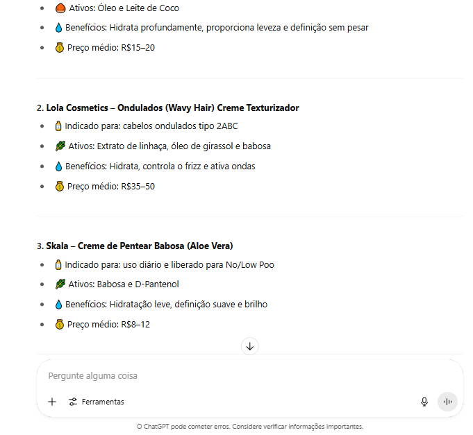
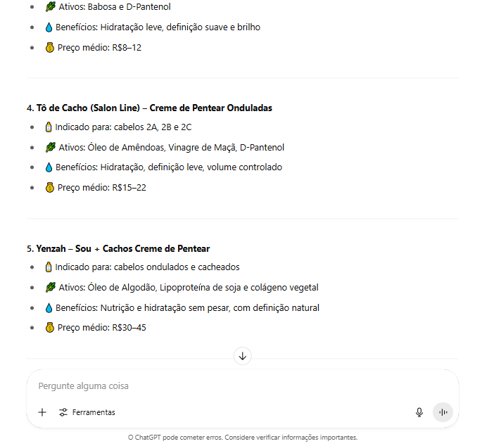

#### Prompt 4
ChatGPT

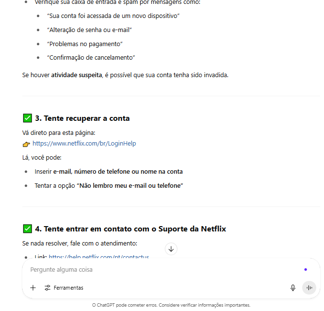
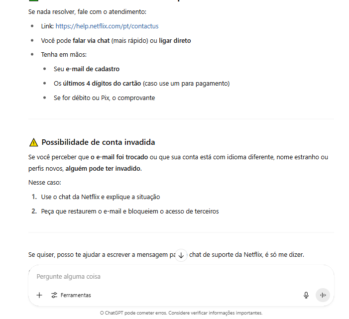

